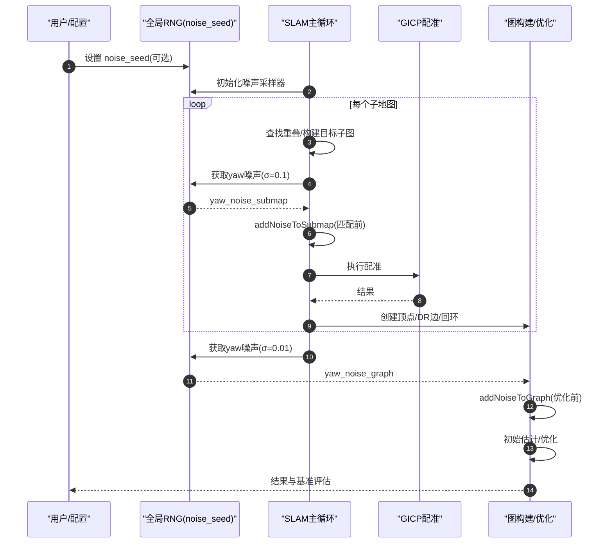

# 高斯噪声实现与随机种子指南

本指南详细介绍了Bathymetric SLAM中高斯噪声的实现机制、配置方法以及可复现性功能的使用。

## 概述

高斯噪声在SLAM系统中用于模拟真实传感器数据中的不确定性和误差，帮助测试算法在存在噪声环境下的鲁棒性。本项目在航迹推算（Dead Reckoning, DR）边上添加高斯噪声，以评估SLAM算法对位姿估计误差的容忍能力。

## 相关配置参数

在 `config.yaml` 文件中，有两个与高斯噪声相关的参数：

```yaml
add_gaussian_noise: true    # 是否在模拟数据中添加高斯噪声
noise_seed: 42             # 可选的随机噪声种子，注释掉或留空则为完全随机
```

### add_gaussian_noise
- **类型**: `boolean`
- **默认值**: `true`
- **功能**: 控制是否在SLAM图的DR边上添加高斯噪声
- **影响**: 当设置为 `true` 时，系统会在每条DR边的航向角（yaw）上添加小幅随机扰动

### noise_seed
- **类型**: `integer`（可选）
- **默认值**: `42`（示例值）
- **功能**: 设置随机数生成器的种子，实现噪声的可复现性
- **使用方法**:
  - 设置具体数值：每次运行产生相同的噪声模式
  - 注释掉或删除：保持完全随机的噪声生成

## 实现原理

### 1. 双阶段噪声注入架构

系统采用**两阶段噪声注入**策略，在SLAM流程的不同环节添加不同类型的高斯噪声：

#### 1.1 第一阶段：子地图级噪声注入（匹配前）
- **函数**: `addNoiseToSubmap()`
- **时机**: GICP点云配准**之前**
- **目标**: 当前处理的子地图位姿和点云
- **噪声参数**: 标准差0.1弧度（yaw轴）
- **模拟对象**: 传感器测量误差、定位系统误差
- **影响**: 直接影响GICP配准的输入数据质量

#### 1.2 第二阶段：图边级噪声注入（匹配后）
- **函数**: `addNoiseToGraph()`
- **时机**: 图构建完成后，图优化**之前**
- **目标**: 图中所有DR（Dead Reckoning）边的测量值
- **噪声参数**: 标准差0.01弧度（yaw轴）
- **模拟对象**: 航迹推算累积误差、里程计系统误差
- **影响**: 影响图优化算法的约束输入

#### 1.3 共同特点
- **噪声维度**: 仅在旋转的yaw轴（航向角）上实际添加噪声
- **噪声分布**: 正态分布，均值为0
- **种子控制**: 两个阶段都使用同一个全局随机数生成器，受`noise_seed`统一控制
- **被禁用的噪声**: 平移噪声和roll/pitch旋转噪声在代码中被注释掉

### 2. 噪声参数与随机种子的作用机制

理解噪声参数和随机种子之间的关系对于正确使用高斯噪声功能至关重要：

#### 2.1 噪声参数的作用

噪声参数定义的是**噪声的统计特性**，即噪声分布的"规格"：

```cpp
// 在 generateGaussianNoise() 函数中
std::vector<double> noiseTranslation = {3, 3, 0.001};      // 平移噪声的标准差
std::vector<double> noiseRotation = {0.0001, 0.0001, 0.001}; // 旋转噪声的标准差

// 构建协方差矩阵（方差 = 标准差²）
Eigen::Matrix3d transNoise = Eigen::Matrix3d::Zero();
for (int i = 0; i < 3; ++i)
  transNoise(i, i) = std::pow(noiseTranslation[i], 2);
```

这些参数决定了：
- **噪声强度**：数值越大，噪声幅度越大
- **分布形状**：定义多维高斯分布的协方差矩阵  
- **相对比例**：不同轴向噪声强度的相对关系

#### 2.2 随机种子的作用

随机种子决定的是**从噪声分布中具体采样什么数值**：

```cpp
// 设置噪声采样器的分布参数（定义"规格"）
transSampler.setDistribution(transNoise);  
rotSampler.setDistribution(rotNoise);

// 随机种子决定从分布中采样的具体数值序列
if (isNoiseSeedSet()) {
    std::mt19937& rng = getGlobalNoiseRNG();
    transSampler.seed(rng());  // 使用确定性种子
    rotSampler.seed(rng());
} else {
    // 使用硬件随机数源产生的随机种子
    std::random_device r;
    std::seed_seq seedSeq{r(), r(), r(), r(), r()};
    vector<int> seeds(2);
    seedSeq.generate(seeds.begin(), seeds.end());
    transSampler.seed(seeds[0]);
    rotSampler.seed(seeds[1]);
}
```

#### 2.3 为什么没有种子时每次效果不同？

在没有设置 `noise_seed` 之前，每次运行的随机化过程：

1. **硬件随机源**：`std::random_device` 产生真正的随机数（来自硬件熵源）
2. **种子生成**：每次运行产生不同的种子序列
3. **结果差异**：相同噪声参数 + 不同种子 = 不同的噪声数值序列

**具体例子**：

假设yaw噪声参数固定为标准差0.01：

```
运行1（随机种子=12345）：yaw噪声序列 [0.008, -0.003, 0.011, -0.007, ...]
运行2（随机种子=67890）：yaw噪声序列 [-0.004, 0.009, -0.002, 0.012, ...]
运行3（随机种子=24681）：yaw噪声序列 [0.006, -0.008, 0.004, -0.001, ...]
```

虽然都符合相同的统计分布（均值0，标准差0.01），但具体数值完全不同。

#### 2.4 设置种子后的确定性机制

当设置了 `noise_seed: 42` 后：

```cpp
// 确定性初始化过程
setNoiseRandomSeed(42);  // 全局RNG始终用种子42初始化

// 每次运行时
std::mt19937& rng = getGlobalNoiseRNG();  // 总是相同的初始状态
transSampler.seed(rng());                 // 总是得到相同的种子值A
rotSampler.seed(rng());                   // 总是得到相同的种子值B
```

**结果**：
- 每次运行，采样器的种子完全相同
- 相同参数 + 相同种子 = **完全相同的噪声序列**
- 实现了噪声的可复现性

#### 2.5 实际应用示例

在图边噪声添加中的体现：

```cpp
void GraphConstructor::addNoiseToGraph(GaussianGen& transSampler, GaussianGen& rotSampler){
    std::mt19937& gen = getGlobalNoiseRNG();  // 获取（可能确定性的）随机数生成器
    std::normal_distribution<> d{0, 0.01};    // yaw噪声分布：均值0，标准差0.01
    
    for (size_t i = 0; i < drEdges_.size(); ++i) {
        double yaw = d(gen);  // 从分布中采样yaw噪声值
        // ... 将噪声应用到第i条边的测量值
    }
}
```

- **无种子**：每次运行，`gen`状态不同，`d(gen)`产生不同序列
- **有种子**：每次运行，`gen`初始状态相同，`d(gen)`产生相同序列

#### 2.6 类比理解

可以这样理解噪声参数与随机种子的关系：

- **噪声参数**：定义了"从什么样的袋子里摸球"（袋子里球的分布）
- **随机种子**：决定了"按什么顺序摸球"（摸球的具体序列）
- **可复现性**：固定种子 = 每次都按相同顺序摸球 = 得到相同结果
- **随机性**：不固定种子 = 每次摸球顺序随机 = 符合统计规律但结果不同

### 3. 代码实现架构

高斯噪声的实现分布在以下几个关键文件中：

#### 3.1 全局随机数管理 (`utils_g2o.hpp/cpp`)
```cpp
// 核心API
void setNoiseRandomSeed(int seed);      // 设置全局随机种子
bool isNoiseSeedSet();                  // 检查种子是否已设置
std::mt19937& getGlobalNoiseRNG();      // 获取全局随机数生成器
int getCurrentNoiseSeed();              // 获取当前使用的噪声种子
```

#### 3.2 噪声生成器初始化 (`generateGaussianNoise`)
- 定义平移和旋转的噪声协方差矩阵
- 根据是否设置种子来决定采样器的初始化方式
- 返回信息矩阵供后续使用

#### 3.3 图边噪声添加 (`GraphConstructor::addNoiseToGraph`)
- 遍历所有DR边
- 对每条边的航向角添加正态分布噪声
- 更新边的测量值

### 4. 数据管道与执行时序

#### 4.1 完整的SLAM流程与噪声注入时序

```
📊 SLAM执行流程 & 噪声注入时机
════════════════════════════════════════════════════════════════

1. 系统初始化
   ├── 加载 config.yaml 配置
   ├── 设置随机种子 (如果配置了 noise_seed)
   └── 初始化噪声采样器 generateGaussianNoise()

2. 子地图处理循环 (对每个子地图执行)
   ├── 寻找与已注册子地图的重叠区域
   ├── 构建目标子地图 (合并重叠的已注册子地图)
   ├── 🔴 第一阶段噪声注入: addNoiseToSubmap()
   │   ├── 噪声参数: std=0.1弧度 (yaw轴)  
   │   ├── 目标: 当前子地图的位姿和点云
   │   └── 影响: GICP配准的输入数据
   ├── 执行 GICP 点云配准
   ├── 创建图顶点和DR边
   └── 寻找并创建回环闭合边

3. 图构建后处理
   ├── 🔴 第二阶段噪声注入: addNoiseToGraph()
   │   ├── 噪声参数: std=0.01弧度 (yaw轴)
   │   ├── 目标: 所有DR边的测量值
   │   └── 影响: 图优化的约束输入
   ├── 创建初始估计
   └── 执行 Ceres 图优化

4. 结果输出与评估
   └── 生成基准测试结果
════════════════════════════════════════════════════════════════
```



#### 4.2 两阶段噪声的数据管道

##### 第一阶段数据管道 - 子地图级噪声 (`addNoiseToSubmap`)

```cpp
// 调用位置: bathy_slam.cpp 第87行
if (config["add_gaussian_noise"].as<bool>()) {
    addNoiseToSubmap(transSampler, rotSampler, submap_i);
}

// 数据流:
输入: SubmapObj submap_i (原始子地图)
├── 提取当前位姿: submap.submap_tf_
├── 生成yaw噪声: std::normal_distribution<>{0, 0.1}(getGlobalNoiseRNG())
├── 构建噪声变换矩阵: AngleAxisd(yaw_noise, Vector3d::UnitZ())
├── 应用噪声变换到点云: pcl::transformPointCloud()
└── 更新子地图位姿: submap.submap_tf_ = noisy_transform

输出: SubmapObj submap_i (带噪声的子地图)
```

##### 第二阶段数据管道 - 图边级噪声 (`addNoiseToGraph`)

```cpp
// 调用位置: test_slam_real.cpp create_initial_graph_estimate()
if (add_gaussian_noise) {
    graph_obj.addNoiseToGraph(transSampler, rotSampler);
}

// 数据流:
输入: vector<EdgeSE3*> drEdges_ (DR边集合)
├── 对每条DR边的测量值 drMeas_[i]:
├── 提取原始位姿变换: meas_i.translation(), meas_i.linear()
├── 生成yaw噪声: std::normal_distribution<>{0, 0.01}(getGlobalNoiseRNG())
├── 构建噪声变换: AngleAxisd(yaw_noise, Vector3d::UnitZ())
├── 应用噪声: rot = gtQuat * noise_rot, trans = gtTrans + noise_trans
└── 更新边测量值: drMeas_[i] = noisy_measurement

输出: vector<Eigen::Isometry3d> drMeas_ (带噪声的DR边测量值)
```

#### 4.3 噪声参数详细对比

| 特性                | 第一阶段 (addNoiseToSubmap) | 第二阶段 (addNoiseToGraph) |
|---------------------|----------------------------|---------------------------|
| **标准差**          | 0.1 弧度                   | 0.01 弧度                 |
| **噪声强度**        | 较强 (约5.7度)             | 较弱 (约0.57度)           |
| **应用频率**        | 每个有重叠的子地图一次      | 所有DR边一次性处理        |
| **影响范围**        | 单个子地图                 | 整个位姿图               |
| **数据类型**        | 子地图位姿 + 点云          | 图边测量值               |
| **测试目标**        | GICP配准鲁棒性             | 图优化纠错能力           |
| **错误来源模拟**     | 传感器测量误差             | 航迹推算累积误差          |

#### 4.4 种子控制范围

```cpp
// 全局种子控制两个阶段的示例
setNoiseRandomSeed(42);  // 设置种子42

// 第一阶段使用
std::mt19937& gen1 = getGlobalNoiseRNG();  // 从种子42的序列中取值
double yaw_noise_1 = std::normal_distribution<>{0, 0.1}(gen1);

// 第二阶段使用  
std::mt19937& gen2 = getGlobalNoiseRNG();  // 继续从相同序列中取值
double yaw_noise_2 = std::normal_distribution<>{0, 0.01}(gen2);

// 结果: 相同种子 → 完全可复现的噪声序列
```

### 5. 执行流程总结

1. **系统初始化**: 加载配置、设置种子、初始化采样器
2. **双阶段噪声注入**: 分别在配准前和图优化前注入不同强度的噪声
3. **统一种子控制**: 一个种子控制整个流程的所有随机性
4. **分层测试策略**: 既测试前端配准也测试后端优化的鲁棒性

## 使用指南

### 启用高斯噪声

在 `config.yaml` 中设置：
```yaml
add_gaussian_noise: true
```

### 实现可复现的噪声

为了获得可重复的实验结果，设置固定的随机种子：
```yaml
add_gaussian_noise: true
noise_seed: 12345          # 使用任意整数作为种子
```

每次运行程序时，将产生完全相同的噪声模式。

### 使用完全随机的噪声

如果需要每次运行都产生不同的噪声：
```yaml
add_gaussian_noise: true
# noise_seed: 12345        # 注释掉或删除这一行
```

或者完全删除 `noise_seed` 配置项。

### 禁用高斯噪声

如果不需要添加噪声：
```yaml
add_gaussian_noise: false
# noise_seed的设置在此情况下不起作用
```

### 查看当前使用的种子

程序运行时会在终端自动输出当前使用的随机种子，无论是用户指定的还是系统自动生成的：

**用户指定种子时的输出**：
```
高斯噪声种子已设置为: 42 (用户指定)
=== 噪声系统已初始化 ===
实际使用的噪声种子: 42
正在使用种子 42 添加高斯噪声到图边...
已成功向图添加高斯噪声
```

**系统自动生成种子时的输出**：
```
未指定噪声种子，将使用随机种子
=== 噪声系统已初始化 ===
实际使用的噪声种子: 1847206849
正在使用种子 1847206849 添加高斯噪声到图边...
已成功向图添加高斯噪声
```

这样，如果您想复现某次特定的运行结果，只需要记录输出的种子值，然后在配置文件中设置：
```yaml
noise_seed: 1847206849  # 使用之前运行时显示的种子值
```

## 技术细节

### 双阶段噪声参数详解

系统在两个阶段使用不同的噪声参数配置：

#### 第一阶段参数 (`addNoiseToSubmap`)

```cpp
// 位置: utils_g2o.cpp addNoiseToSubmap() 函数
std::mt19937& gen = getGlobalNoiseRNG();        // 全局种子控制的随机数生成器
std::normal_distribution<> d{0, 0.1};           // yaw噪声: 均值0，标准差0.1弧度(5.73°)

// 噪声应用
double roll = 0.0, pitch = 0.0, yaw = d(gen);  // 只有yaw有噪声
Matrix3d m = AngleAxisd(roll, Vector3d::UnitX()) * 
             AngleAxisd(pitch, Vector3d::UnitY()) * 
             AngleAxisd(yaw, Vector3d::UnitZ());   // 构建旋转矩阵
```

#### 第二阶段参数 (`addNoiseToGraph`)

```cpp
// 位置: graph_construction.cpp addNoiseToGraph() 函数
std::mt19937& gen = getGlobalNoiseRNG();        // 相同的全局随机数生成器
std::normal_distribution<> d{0, 0.01};          // yaw噪声: 均值0，标准差0.01弧度

// 噪声应用
double roll = 0.0, pitch = 0.0, yaw = d(gen);  // 只有yaw有噪声
Matrix3d m = AngleAxisd(roll, Vector3d::UnitX()) * 
             AngleAxisd(pitch, Vector3d::UnitY()) * 
             AngleAxisd(yaw, Vector3d::UnitZ());   // 构建旋转矩阵
```
#### 建议参数

1. 子地图级（匹配前，addNoiseToSubmap）
  - 建议范围: 1°–3°（0.017–0.052 rad）
  - 常用默认: 2°（≈0.035 rad）
  - 实验代码选择：0.05 rad
2. 图边级（优化前，addNoiseToGraph）
  - 建议范围: 0.3°–1.0°（0.005–0.017 rad）
  - 常用默认: 0.5°（≈0.0087 rad）
  - 实验代码选择：0.005 rad

> 小提示: 子地图级 $σ_{yaw}$ ≈ 图边级 $σ_{yaw}$ 的 5–10 倍

#### 配置参数对比（在 `generateGaussianNoise()` 中定义但未直接使用）

```cpp
// 这些参数用于初始化采样器，但实际噪声由上述两个函数中的分布生成
std::vector<double> noiseTranslation = {3, 3, 0.001};      // 平移噪声参数（未使用）
std::vector<double> noiseRotation = {0.0001, 0.0001, 0.001}; // 旋转噪声参数（未直接使用）
```

#### 参数总结表

| 参数类型 | 第一阶段 | 第二阶段 | 说明 |
|---------|---------|---------|------|
| **yaw标准差** | 0.1弧度 (~5.7°) | 0.01弧度 (~0.57°) | 实际使用的参数 |
| **roll噪声** | 0.0 | 0.0 | 被禁用 |
| **pitch噪声** | 0.0 | 0.0 | 被禁用 |  
| **平移噪声** | 0.0 | 0.0 | 被禁用 |
| **随机数源** | getGlobalNoiseRNG() | getGlobalNoiseRNG() | 相同的种子控制 |

**关键说明**: 
- 虽然 `generateGaussianNoise()` 配置了完整的6DOF噪声采样器，但实际的噪声生成在两个阶段函数中独立进行
- 两个阶段都只在yaw轴添加噪声，但强度不同
- 种子控制影响两个阶段，确保整体可复现性

### 随机数生成器选择

- **类型**: `std::mt19937`（梅森旋转算法）
- **优点**: 高质量伪随机数，周期长，统计特性好
- **种子管理**: 通过全局单例模式确保整个程序使用统一的随机数源
- **种子记录**: 系统自动记录并输出当前使用的种子值，便于结果复现

### 种子输出机制

系统在以下时机输出种子信息：

1. **配置阶段**: 显示是否设置了用户指定的种子
2. **初始化阶段**: 显示实际使用的种子值（可能是用户指定的或自动生成的）
3. **应用阶段**: 在实际添加噪声时再次确认使用的种子

这种多层次的输出确保用户始终清楚当前使用的种子值，便于调试和结果复现。

### 噪声应用时机

噪声在以下阶段被应用：
1. **图构建完成后**: 在所有DR边创建完毕后统一添加噪声
2. **优化开始前**: 确保图优化算法处理的是已加噪的测量值
3. **一次性操作**: 噪声只在初始图构建时添加一次

## 扩展与定制

### 修改双阶段噪声参数

如需调整噪声的强度或类型，需要分别修改两个阶段的代码：

#### 第一阶段噪声修改 (`addNoiseToSubmap` in `utils_g2o.cpp`)

1. **调整第一阶段yaw噪声强度**:
```cpp
// 修改第122-123行
std::mt19937& gen = getGlobalNoiseRNG();
std::normal_distribution<> d{0, 0.2};  // 将标准差从0.1改为0.2（更强噪声）
```

2. **启用第一阶段平移噪声**:
```cpp
// 修改第134-135行
Eigen::Vector3d trans = transSampler.generateSample();  // 取消注释
// trans.setZero();  // 注释掉这一行
```

#### 第二阶段噪声修改 (`addNoiseToGraph` in `graph_construction.cpp`)

1. **调整第二阶段yaw噪声强度**:
```cpp
// 修改第202-203行
std::mt19937& gen = getGlobalNoiseRNG();
std::normal_distribution<> d{0, 0.02};  // 将标准差从0.01改为0.02（更强噪声）
```

2. **启用第二阶段平移噪声**:
```cpp
// 修改第229-230行
Eigen::Vector3d trans = transSampler.generateSample();  // 取消注释  
// trans.setZero();  // 注释掉这一行
```

#### 统一修改采样器参数 (`generateGaussianNoise` in `utils_g2o.cpp`)

虽然实际噪声由各阶段独立生成，但可以调整采样器的基础参数：

```cpp
// 修改第73-78行
noiseTranslation.push_back(1.0);   // x平移噪声 (原为3.0)
noiseTranslation.push_back(1.0);   // y平移噪声 (原为3.0)  
noiseTranslation.push_back(0.05);  // z平移噪声 (原为0.001)
noiseRotation.push_back(0.01);     // roll旋转噪声 (原为0.0001)
noiseRotation.push_back(0.01);     // pitch旋转噪声 (原为0.0001)
noiseRotation.push_back(0.02);     // yaw旋转噪声 (原为0.001)
```

#### 启用roll/pitch旋转噪声

**第一阶段启用**（`utils_g2o.cpp`）:
```cpp
// 修改第125-131行，使用采样器生成的噪声
Eigen::Vector3d quatXYZ = rotSampler.generateSample();
double qw = 1.0 - quatXYZ.norm();
if (qw < 0) qw = 0.;
Eigen::Quaterniond rot(qw, quatXYZ.x(), quatXYZ.y(), quatXYZ.z());  // 取消注释
// 注释掉下面的简化yaw噪声生成部分
```

**第二阶段启用**（`graph_construction.cpp`）:
```cpp
// 修改第217-223行，使用采样器生成的噪声
Eigen::Vector3d quatXYZ = rotSampler.generateSample();
double qw = 1.0 - quatXYZ.norm();
if (qw < 0) qw = 0.;
Eigen::Quaterniond rot(qw, quatXYZ.x(), quatXYZ.y(), quatXYZ.z());  // 取消注释
// 注释掉下面的简化yaw噪声生成部分
```

#### 创建不同强度的噪声组合

您可以为两个阶段设置不同的噪声强度组合：

```cpp
// 示例配置：强前端噪声 + 弱后端噪声
// 第一阶段: std=0.2 (测试GICP鲁棒性)
// 第二阶段: std=0.005 (轻微图优化扰动)

// 或者：弱前端噪声 + 强后端噪声  
// 第一阶段: std=0.05 (轻微配准扰动)
// 第二阶段: std=0.02 (测试图优化纠错能力)
```

### 从配置文件读取噪声参数

未来版本可以考虑将硬编码的双阶段噪声参数移至 `config.yaml`：

```yaml
gaussian_noise_config:
  # 第一阶段噪声配置（匹配前）
  submap_level:
    yaw_std: 0.1          # yaw轴标准差（弧度）
    translation_std: [0.0, 0.0, 0.0]    # x,y,z平移标准差
    rotation_std: [0.0, 0.0, 0.1]       # roll,pitch,yaw旋转标准差
    
  # 第二阶段噪声配置（匹配后）  
  graph_level:
    yaw_std: 0.01         # yaw轴标准差（弧度）
    translation_std: [0.0, 0.0, 0.0]    # x,y,z平移标准差
    rotation_std: [0.0, 0.0, 0.01]      # roll,pitch,yaw旋转标准差
    
  # 采样器基础参数
  sampler_config:
    translation_base: [3.0, 3.0, 0.001]
    rotation_base: [0.0001, 0.0001, 0.001]
```

实现示例：
```cpp
// 在相应函数中读取配置
YAML::Node noise_config = config["gaussian_noise_config"];
double submap_yaw_std = noise_config["submap_level"]["yaw_std"].as<double>();
double graph_yaw_std = noise_config["graph_level"]["yaw_std"].as<double>();

// 在 addNoiseToSubmap() 中使用
std::normal_distribution<> d{0, submap_yaw_std};

// 在 addNoiseToGraph() 中使用  
std::normal_distribution<> d{0, graph_yaw_std};
```

## 故障排除

### 编译错误
- 确保所有相关头文件正确包含
- 检查 `std::mt19937` 拼写是否正确

### 运行时问题
- 验证 `config.yaml` 语法正确
- 确认 `noise_seed` 为整数类型
- 检查程序输出中的种子设置确认信息

### 结果验证
- 使用相同种子多次运行，确认结果一致性
- 比较有噪声和无噪声运行的轨迹差异
- 通过基准测试评估噪声对SLAM性能的影响
- 检查终端输出的种子值，确保使用了预期的种子

### 种子相关问题
- **问题**: 设置了种子但每次运行结果仍不同
  - **解决**: 检查终端输出确认种子确实被设置，确保没有其他随机源干扰
- **问题**: 想复现之前的运行但忘记记录种子
  - **解决**: 下次运行时注意记录终端输出的种子值
- **问题**: 自动生成的种子值很大，不容易记忆
  - **解决**: 可以在配置文件中设置简单的种子值如42, 123等

### 双阶段噪声相关问题
- **问题**: 只想测试GICP配准的鲁棒性，不想要图优化噪声
  - **解决**: 在 `addNoiseToGraph()` 函数中将噪声标准差设为0.0或注释掉噪声添加代码
- **问题**: 只想测试图优化的纠错能力，不想要配准噪声
  - **解决**: 在 `addNoiseToSubmap()` 函数中将噪声标准差设为0.0或注释掉噪声添加代码
- **问题**: 两个阶段的噪声强度不合适
  - **解决**: 分别调整两个函数中的 `std::normal_distribution<>` 参数
- **问题**: 想要不同的噪声类型组合（如第一阶段平移噪声+第二阶段旋转噪声）
  - **解决**: 按照"扩展与定制"章节的说明分别启用不同类型的噪声
- **问题**: 不确定哪个阶段的噪声在起作用
  - **解决**: 
    1. 查看终端输出的噪声应用信息
    2. 分别禁用两个阶段测试效果差异
    3. 查看基准测试结果中的误差变化模式

## 参考信息

### 相关源码文件
- **主要实现**:
  - `src/graph_optimization/src/utils_g2o.cpp` - 全局随机数管理、第一阶段噪声实现
  - `src/graph_optimization/src/graph_construction.cpp` - 第二阶段噪声实现
  - `src/apps/src/test_slam_real.cpp` - 噪声控制流程、种子设置
  - `src/bathy_slam/src/bathy_slam.cpp` - 第一阶段噪声调用

- **头文件**:
  - `src/graph_optimization/include/graph_optimization/utils_g2o.hpp` - 全局随机数API声明
  - `src/graph_optimization/include/graph_optimization/graph_construction.hpp` - 图构造相关声明
  - `src/bathy_slam/include/bathy_slam/bathy_slam.hpp` - SLAM主流程声明

### 配置文件
- `config.yaml` - 噪声控制开关和种子设置

### 关键数据类型
- `GaussianGen`: g2o::GaussianSampler<Eigen::Vector3d, Eigen::Matrix3d>
- `std::mt19937`: 梅森旋转随机数生成器
- `std::normal_distribution<>`: 正态分布噪声生成器

### 相关SLAM概念
- **DR边**: Dead Reckoning边，表示航迹推算的位姿变换
- **GICP**: Generalized Iterative Closest Point，广义迭代最近点算法
- **子地图**: Submap，包含多束测深数据的局部地图单元
- **位姿图**: Pose Graph，节点表示位姿，边表示约束的图结构

## 工程评估与建议

### 1) 工程现实性评估

- 子地图级噪声（匹配前，yaw 0.1rad）：能够有效模拟导航/姿态估计误差对点云配准初值与几何一致性的影响，常见于罗经/IMU航向漂移、传感器标定误差等，工程上合理。
- 图边级噪声（优化前，yaw 0.01rad）：能够模拟里程计/DR边约束中的测量噪声与累积误差，工程上也常见且必要，便于评估图优化的鲁棒性与收敛域。
- 统一随机种子：保证端到端可复现性，便于A/B对比和参数回归测试，工程实践强烈推荐。

结论：当前“双阶段、统一种子”的噪声注入策略，从工程角度能较好模拟实际SLAM链路中前端与后端的主要随机误差来源，且对评测与调参友好。

### 2) 已知局限性

- 仅在 yaw 轴注入旋转噪声，未覆盖 roll/pitch 与平移噪声；对强三维姿态耦合场景（大坡度地形、姿态剧变平台）可能低估困难度。
- 噪声为零均值独立高斯，未模拟慢变偏置（bias）、时间相关性（随机游走）与非高斯尾部（外点），与真实导航误差统计并不完全一致。
- 噪声强度为固定常数，未随行驶距离/时间/环境特性自适应变化，难以覆盖“累计/漂移型”误差的真实增长规律。

### 3) 对SLAM效果的影响（正/负面）

- 正面：
  - 前端：在匹配前扰动子地图，有助于检验 GICP 初值敏感性与收敛稳定性；
  - 后端：在优化前扰动DR边，有助于检验图优化对错误约束的容忍度与收敛半径；
  - 统一种子便于稳定复现实验，可靠比较算法/参数差异。
- 负面（需知晓而非缺陷）：
  - 若仅 yaw 扰动，可能对某些三维场景的压力不足；
  - 固定方差的独立高斯噪声，无法覆盖更复杂的系统误差模式。

### 4) 建议的工程改进（可选，保持YAGNI/KISS）

- 渐进式增强而非一次性复杂化：
  1. 可选启用 roll/pitch 与平移噪声（仍默认关闭，避免破坏现有行为）；
  2. 噪声强度可从 `config.yaml` 读取，分阶段配置（已在文档给出配置草案）；
  3. 可选引入随距离/时间增长的噪声模型，模拟累计漂移；
  4. 可选引入小幅偏置（bias）与一阶马尔可夫过程，模拟时间相关性；
  5. 针对极端外点场景，提供轻量级重尾分布选项（如混合高斯，默认关闭）。

以上改进建议保持为“可选项”，默认仍使用当前简单而稳定的方案，以符合YAGNI/KISS；只有当测试需要覆盖更复杂场景时再逐步启用。

